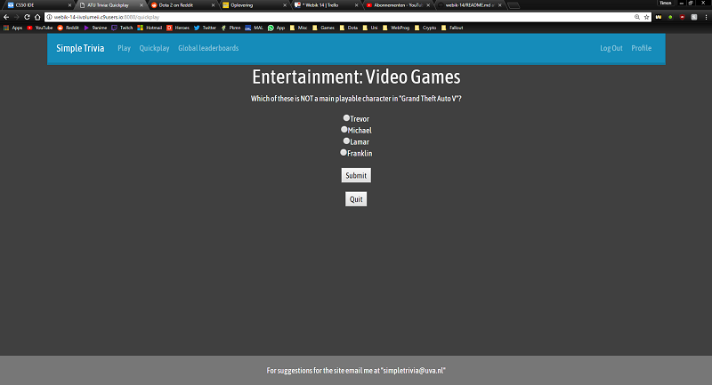

# Simple Trivia

Een triviawebsite gemaakt door Timon Brouwer (11857692) uit groep 14

## Features

De huidige features van deze triviasite zijn:

- Het maken van accounts
  - Registeren
  - Inloggen
  - Wachtwoord veranderen
- Triviavragen van verschillende categorieen, moeilijkheden en vraagtypes beantwoorden
- Het bijhouden van scores
- Global leaderboards met de top 5 spelers
- Een eigen profiel
- Een homepage
- Een learn more pagina met meer informatie

## Repository

- De model van de code bestaat uit helpers.py en users.py. In users.py staan functies omtrent het registreren en inloggen en in helpers.py staan functies voor de triviavragen en de scores
- De view bestaat uit de bestanden in het mapje templates
- De controller van de code bestaat uit application.py
