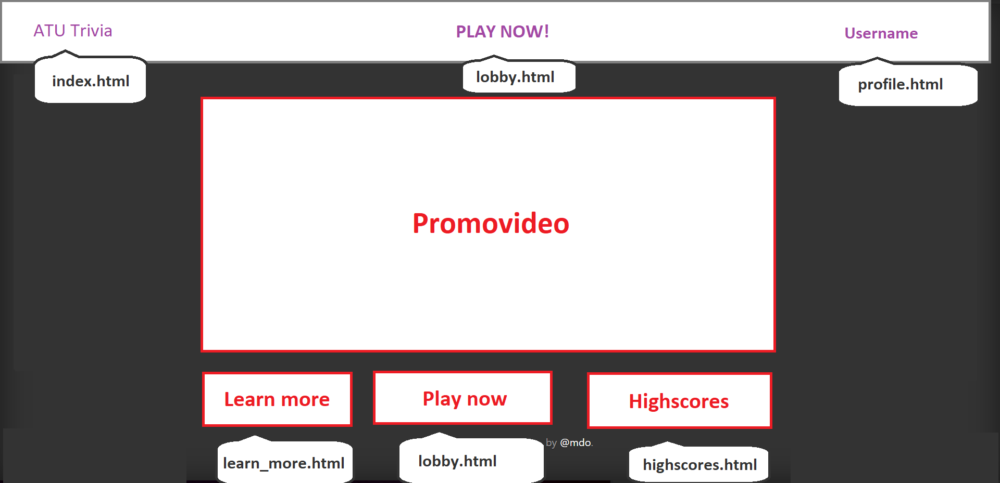
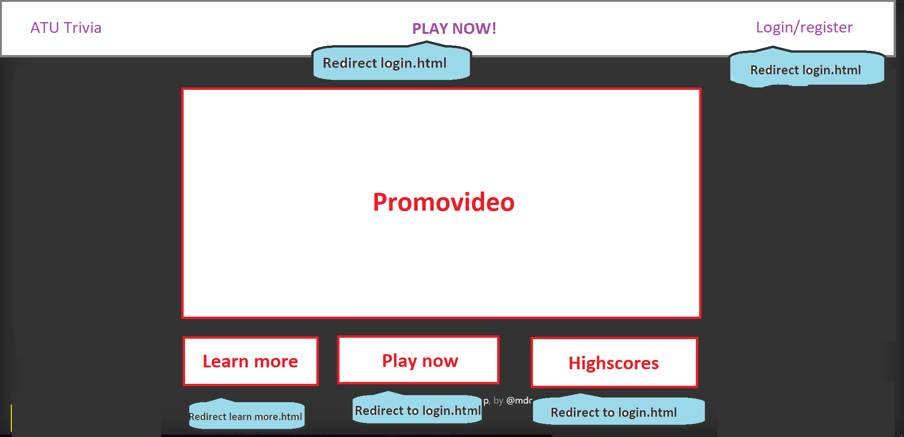
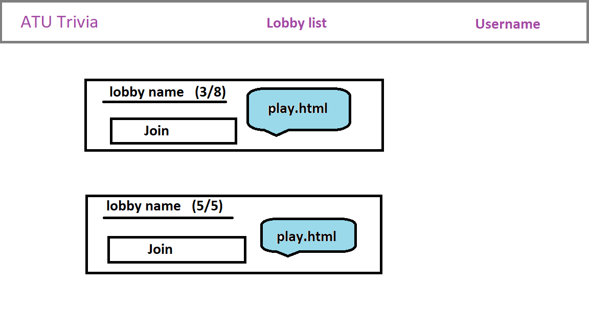
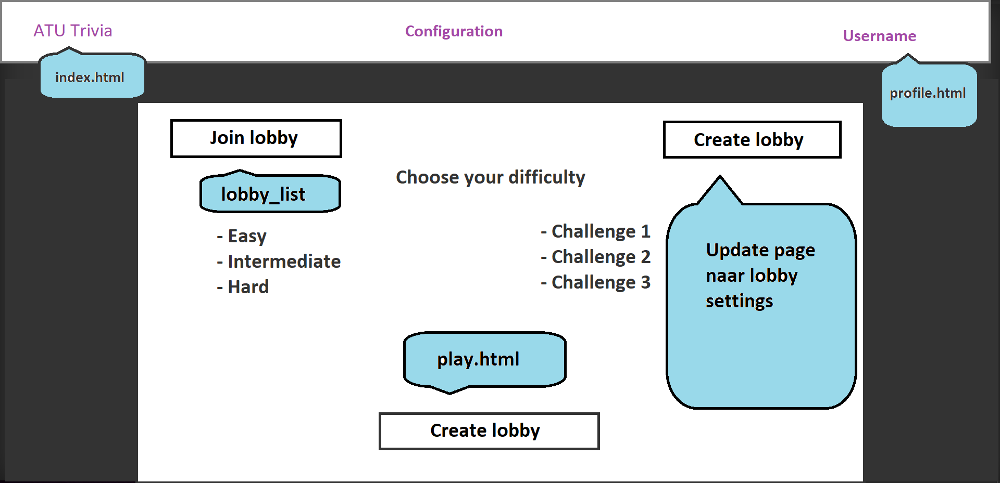
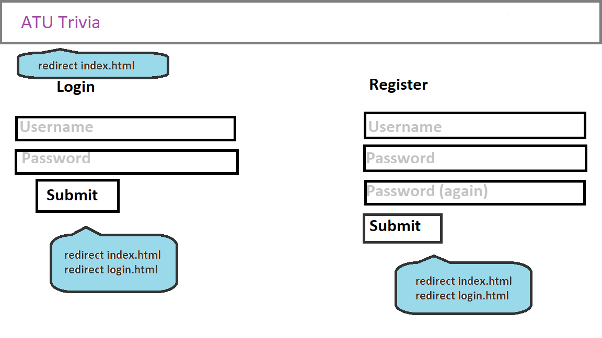
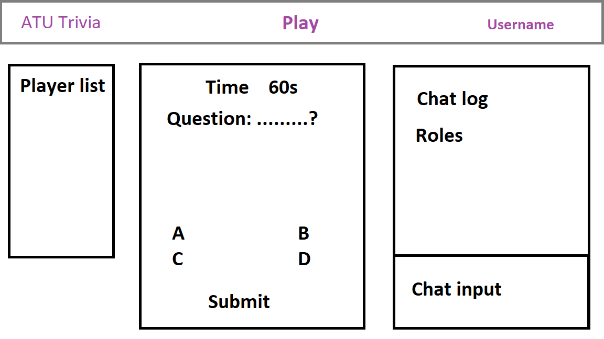
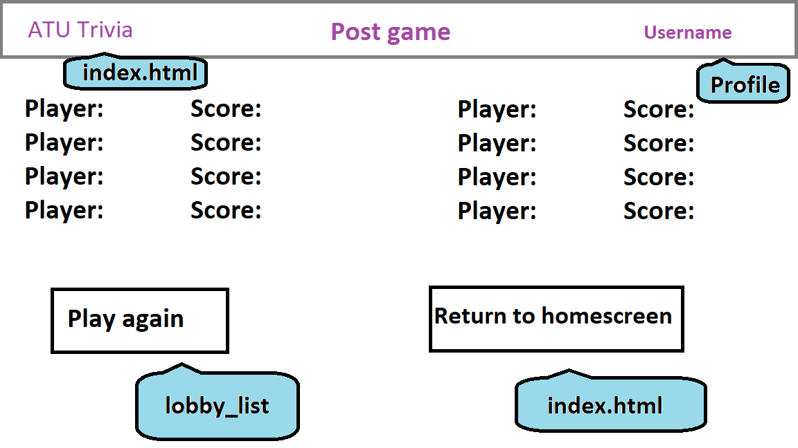
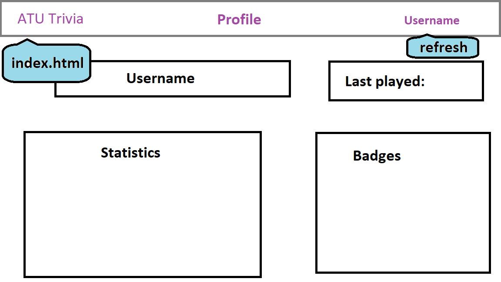

# Technisch ontwerp

## Controllers

Wij definieren diverse functies in application.py die elk een bepaalde 'route' afhandelen.

### Routes:
- Index (homepagina/ startpagina. Hub om te navigeren)
    - @app.route("/")
    - GET
    - Eigen scherm
- Login (inloggen, mogelijk wachtwoord vergeten toevoegen aan deze route)
    - @app.route("/login")
    - GET & POST
    - Eigen scherm
- Register (registreren)
    - @app.route("/register")
    - GET & POST
    - Eigen scherm
- Configuration (moeilijkheidsgraad, gamemode, challenges, lobbysettings)
    - @app.route("/configuration")
    - GET & POST
    - Eigen scherm
- Lobby (trivia spelen, score zien, configuration zien)
    - @app.route("/lobby")
    - GET & POST
    - Eigen scherm
- Chat (live communiceren over de vragen, gebruikersnamen kunnen zien, rollen verdelen)
    - @app.route("/chat")
    - GET & POST
    - Toegevoegd bij lobby scherm
- Scoreboard (zien van de scores en mogelijk het zoeken van spelers)
    - @app.route("/scoreboard")
    - GET & POST
    - Eigen scherm
- Profile (zien van je eigen statistieken en badges)
    - @app.route("/profile")
    - GET
    - Eigen scherm
- Learn more (informatie over het spel, spelregels, tips)
    - @app.route("/learn_more")
    - GET
    - Eigen scherm

## Views

## Models/helpers

- apology() -> in het geval een actie niet mogelijk is of als er iets fout gaat
- login_required -> op veel pagina's moet het vereist zijn om ingelogd te zijn

## Plugins en frameworks

- Flask-SocketIO-Chat
    - https://github.com/miguelgrinberg/Flask-SocketIO-Chat
    - Dit is een chat plugin die we gebruiken in de lobby (hopelijk)
- Bootstrap (getbootstrap.com)
    - Lumen bootstrap
        - https://bootswatch.com/lumen/
        - Ontwerp van de site